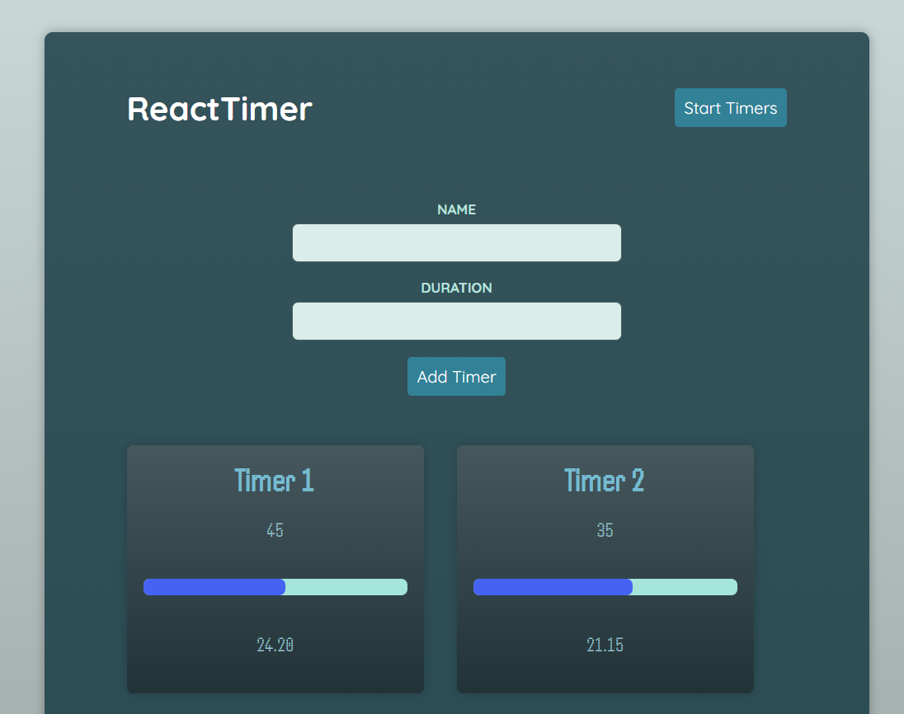

# Timer App - React / TypeScript 

  ## Description

  A timer application built with React.js and TypeScript

  ### App Screenshot
  
  
  ## Table of Contents
  
  - [Installation](#installation)
  - [Usage](#usage)
  - [License](#license)
  - [Contributing](#contributing)
  - [Tests](#tests)
  - [Questions](#questions)
  
  ## Installation
  
  Deployed URL: https://billstephens2022.github.io/TimerApp-React-TypeScript/
  
  ## Usage
  
  Add a timer by providing a name for the timer and the duration (in seconds) and clicking the 'Add Timer' button. A timer will be added  to the screen and will begin counting down along with a continuously updating progress bar.  Add as many timers as you like.  Click button on top right to toggle stopping and restarting timers.

  ## License
This application is covered under the MIT License.
 For more information: https://opensource.org/licenses/MIT
  
  ## Contributing
  N/A
  
  ## Tests
  N/A

  ## Questions
  Contact Info 
  GitHub user name: BillStephens2022 
  Link to GitHub profile: https://github.com/BillStephens2022 
  Email: stephensbill17@gmail.com
